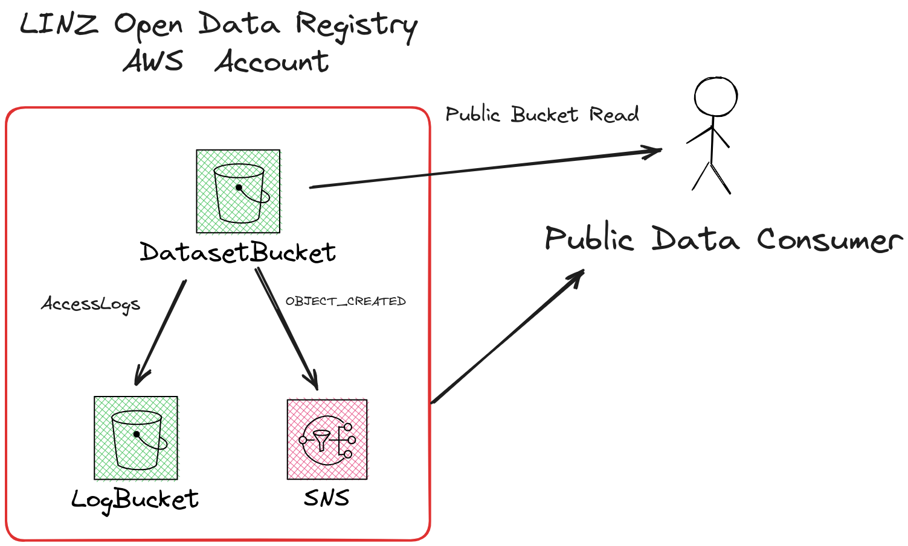
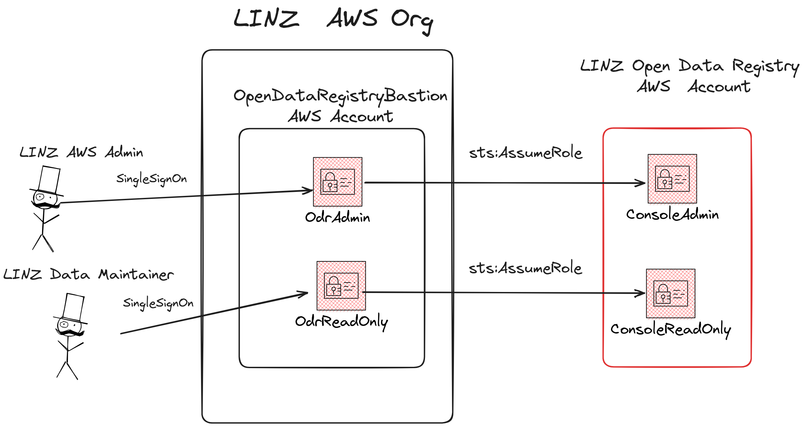

# LINZ Open Data Registry Setup

## Background

LINZ has a collection of Satellite and Aerial imagery (~20TB compressed and growing). These files are currently stored as lossless WebP COGs with [STAC metadata](https://stacspec.org/en/) in AWS S3.

[AWS Registry of Open Data](https://registry.opendata.aws/) (ODR/RODA) is a sponsorship process whereby AWS will pay for storage and egress costs for open data. 

AWS open data registry requires that the S3 bucket containing the datasets to be in a standalone AWS account, this account will be assoicated to a AWS Managed Organisation, This repository contains the AWS CDK infrastructure for bootstrapping of this new account and allowing LINZ users to access the standalone AWS account with their standard Single Sign On process.

### Infrastructure

The base open data registry infrastructure contains 

- S3 Bucket - Dataset Bucket where the open data is stored, it is publicly readable
- SNS Topic - AWS S3 OBJECT_CREATED events are emitted from the 
- S3 Bucket - Log Bucket, S3 Access logs from the dataset bucket are stored  here.

## Console Access

To grant LINZ users access to the standalone AWS ODR account a LINZ managed bastion account is used. The bastion account contains two roles that are assoicated with LINZ Single Signon. `role/BastionOdrAdmin` and `role/BastionOdrReadOnly` these two roles have been given access ([console.ts](./src/console.ts)) to assume the corresponding `role/ConsoleAdmin` and `role/ConsoleReadOnly` roles inside of the LINZ ODR account.

## Data publishing

LINZ uses a AWS EKS kubernetes cluster for all of it's imagery processing:

- [linz/topo-workflows](https://github.com/linz/topo-workflows) - Argo Workflows
- [linz/argo-tasks](https://github.com/linz/argo-tasks) - Argo utlity containers
- [linz/topo-imagery](https://github.com/linz/topo-imagery) - Imagery processing containers

This EKS Cluster has been given access to assume a role `role/DataMaintainer` inside of the LINZ's ODR account ([./dataset.ts](./src/dataset.ts)), this role has the permission to write data into the main dataset bucket.