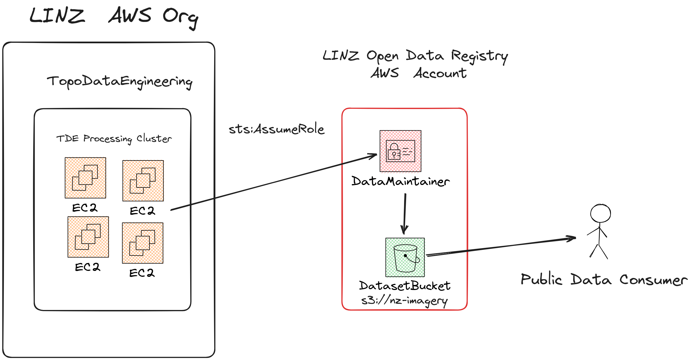

# LINZ Open Data Registry Setup

## Background

LINZ has a growing collection of publicly available datasets:

- ~500 GB of _elevation models_ in the form of Limited Error Raster Compression (LERC) Cloud Optimized GeoTIFFs (COGs)
- ~20 TB of _satellite and aerial imagery_ in the form of losslessly compressed WebP COGs.

These datasets are stored in AWS S3 with associated [STAC metadata](https://stacspec.org/).

[AWS Registry of Open Data](https://registry.opendata.aws/) (ODR/RODA) is a sponsorship process whereby AWS will pay for storage and egress costs for open data.

AWS Open Data Registry requires that the S3 buckets containing the datasets should be in a standalone AWS account associated to a AWS Managed Organisation. This repository contains the AWS CDK infrastructure for bootstrapping this account and allowing LINZ users to access it with their standard Single Sign On process.

## Infrastructure

The base open data registry infrastructure contains the following infrastructure, grouped by data type.

### Imagery

- S3 Bucket `s3://nz-imagery` - Dataset Bucket where the satellite and aerial imagery open data is stored. It is publicly readable.
- SNS Topic `nz-imagery-object_created` - AWS S3 `OBJECT_CREATED` events for the `nz-imagery` bucket are emitted from the Amazon Simple Notification Service (SNS).

### Elevation

- S3 Bucket `s3://nz-elevation` - Dataset Bucket where the elevation model open data is stored. It is publicly readable.
- SNS Topic `nz-elevation-object_created` - AWS S3 `OBJECT_CREATED` events for the `nz-elevation` bucket are emitted from the Amazon Simple Notification Service (SNS).

### Coastal Elevation

- S3 Bucket `s3://nz-coastal` - Dataset Bucket where the Coastal Elevation is to be stored. It is publicly readable.
- SNS Topic `nz-coastal-object_created` - AWS S3 `OBJECT_CREATED` events for the `nz-coastal` bucket are emitted from the Amazon Simple Notification Service (SNS).

### Topography

- S3 Bucket `s3://nz-topography` - Dataset Bucket where the topography vector tile open data is to be stored. It is publicly readable.
- SNS Topic `nz-topography-object_created` - AWS S3 `OBJECT_CREATED` events for the `nz-topography` bucket are emitted from the Amazon Simple Notification Service (SNS).

### Common

- S3 Bucket `s3://linz-odr-access-logs` - Log Bucket. It is where the S3 Access logs from the dataset buckets are stored.


### Console Access

To grant LINZ users access to the standalone AWS ODR account a LINZ managed bastion account is used. The bastion account contains two roles that are associated with LINZ Single Sign On. `role/BastionOdrAdmin` and `role/BastionOdrReadOnly` are the two roles that have been given access ([console.ts](./src/console.ts)) to assume the corresponding `role/ConsoleAdmin` and `role/ConsoleReadOnly` roles inside of the LINZ ODR account.


### Data Publishing

LINZ uses a AWS EKS kubernetes cluster for all of its elevation and imagery processing:

- [linz/topo-workflows](https://github.com/linz/topo-workflows) - Argo Workflows
- [linz/argo-tasks](https://github.com/linz/argo-tasks) - Argo utility containers
- [linz/topo-imagery](https://github.com/linz/topo-imagery) - Imagery and elevation processing containers

This EKS Cluster has been given access to assume a role `role/DataMaintainer` inside of the LINZ's ODR account ([dataset.ts](./src/dataset.ts)). This role has the permission to write data into the main dataset bucket.



## Deployment

The infrastructure in this repository is managed with [AWS CDK](https://github.com/aws/aws-cdk).

To deploy, [NodeJs](https://nodejs.org/en) >=22.x is needed.

Install dependencies

```
npm install
```

List the current stacks

```
npx cdk ls
```

- Console - Console access stack
- Datasets - Base dataset stacks + data publishing roles

Diff the console access stack

```bash
npx cdk diff Console
```

Deploy the console stack

```bash
npx cdk deploy Console
```

## Context

To allow customization about which roles and accounts are allowed to assume which roles, there are a number of context variables.

They are accessed by adding `--context :name=:value`. For example `npx cdk deploy Datasets --context dataset-suffix=-test`

### Dataset management context

- `log-reader-role-arns` - Role(s) that can assume the S3 Access read logs role.
- `data-manager-role-arns` - Role(s) that can assume the Data Maintainer role to read/write the dataset bucket.

### Console access context

- `console-read-only-role-arns` - Role(s) that can assume the read only console role.
- `console-admin-role-arns` - Role(s) that can assume the console admin role.

### Testing Context

- `dataset-suffix` - Allow deploying to testing account, by suffixing all named objects (S3 Bucket/SNS Topic).
